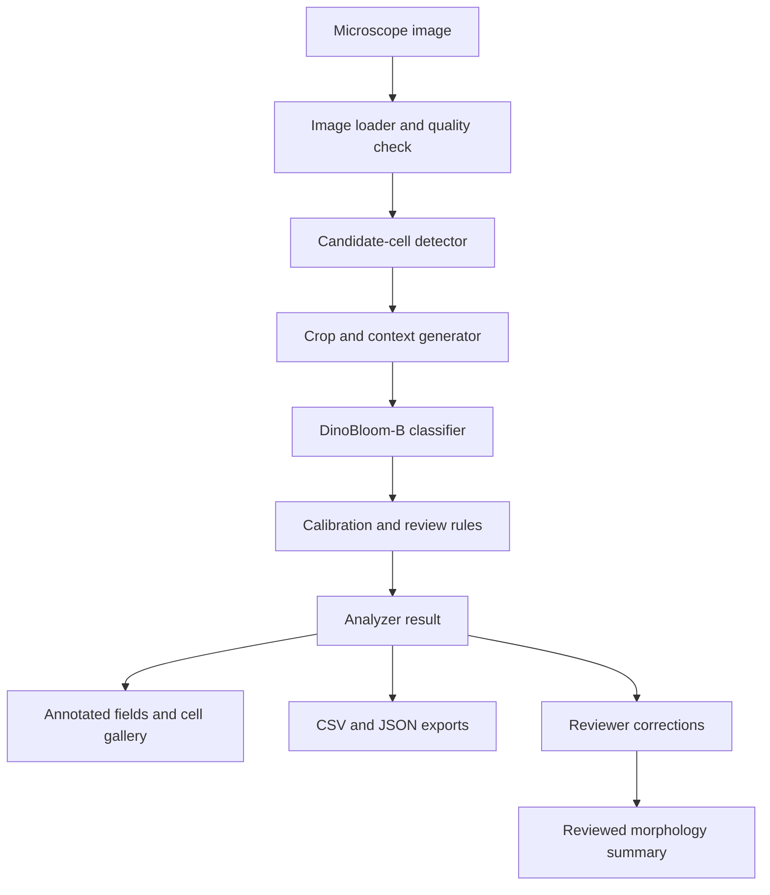

# WBC Blood Film Analyzer

## Technical Design and Implementation Plan

**Version:** 1.0  
**Date:** 26 September 2026  
**Status:** Implementation-ready design  
**Related document:** `WBC_Blood_Film_Analyzer_PRD.md` version 1.2  
**Use context:** Personal, non-commercial research proof of concept  
**Primary classifier:** DinoBloom-B with a task-specific 18-class head  
**Primary classification data:** MLL23  
**Initial detector:** Ultralytics YOLO26n fine-tuned for WBC candidate detection  

## 1. Purpose

This document translates the product requirements into a concrete software and machine-learning design. It defines the repository, module boundaries, data contracts, model interfaces, training stages, evaluation protocol, analyzer workflow, review data, exports, and implementation backlog.

The first complete technical result is:

```text
Microscope field
  → image quality measurements
  → WBC candidate detection
  → safe cell crops
  → DinoBloom-B 18-class classifier
  → calibrated confidence and review status
  → morphology counts and provisional differential
  → annotated image, crop gallery, CSV and JSON
```

All outputs are research results that require expert review. The design does not assume clinical validation.

## 2. Technical decisions

| Area | Selected approach | Reason |
| --- | --- | --- |
| Language | Python 3.11 | Broad PyTorch and scientific ecosystem support |
| ML framework | PyTorch | Required by DinoBloom and suitable for detector/classifier integration |
| Classifier backbone | DinoBloom-B | Hematology-specific pretrained representation; 86M parameters and 768-dimensional embeddings |
| Initial classifier taxonomy | MLL23 18 classes | Closest public dataset to the expanded morphology interface |
| Head candidates | Linear, MLP and cosine | Simple, reproducible comparison supported by recent WBC work |
| First classifier training | Frozen backbone with cached embeddings | Fastest way to establish a valid baseline |
| Later classifier tuning | Unfreeze final blocks, then optional full fine-tuning | Use only when baseline and domain-shift results justify it |
| Detector | Ultralytics YOLO26n | Convenient personal/research POC implementation and training pipeline |
| Detector data | TXL-PBC filtered to WBC | Public field images with YOLO annotations |
| Image processing | OpenCV and Pillow | Field loading, validation, colour conversion, crops and annotations |
| Configuration | YAML validated with Pydantic | Human-readable configuration with typed runtime validation |
| Experiment records | Local JSON/CSV/PNG/checkpoints | Reproducible without a cloud service |
| Notebook | Jupyter | Exploration and visible POC demonstration |
| Reusable API | Plain Python package under `src/` | Keeps model logic independent of notebook and future UI |
| Review UI | Deferred until analyzer passes local-image gate | UI consumes stable analyzer results rather than notebook state |

Because this is personal non-commercial research, the POC may use Ultralytics under its open-source terms and research datasets with non-commercial terms. Every downloaded artifact still receives a license and provenance entry in the data/model registry.

## 3. System architecture



### 3.1 Component boundaries

The detector answers **where a candidate cell is located**. The classifier answers **which morphology label best matches a crop**. The analyzer coordinates both and owns no framework-specific tensor logic.

The initial detector is trained with a WBC label and therefore cannot guarantee detection of every nucleated non-WBC class, particularly normoblasts. The code uses the general name `CandidateCellDetector` so a broader nucleated-cell detector can replace the first implementation later.

### 3.2 Runtime modes

| Mode | Purpose | Required assets |
| --- | --- | --- |
| `smoke` | Validate environment, loading, schemas and one image path | Fixture image; explicit mock components allowed only when visibly marked |
| `extract` | Create cached DinoBloom-B embeddings | DinoBloom-B weights and labelled crop dataset |
| `train_classifier` | Train a head or fine-tune classifier | Dataset manifest, embeddings or backbone, split manifest |
| `evaluate_classifier` | Measure frozen checkpoint | Checkpoint and untouched test manifest |
| `train_detector` | Fine-tune candidate detector | Detection dataset and YAML |
| `inference` | Analyze fields with trained components | Detector and classifier checkpoints |
| `review_export` | Apply reviewer corrections and regenerate summaries | Analyzer JSON plus review records |

No mode silently substitutes a missing model.

## 4. Canonical taxonomy

### 4.1 MLL23 18-class classifier

The checkpoint stores the exact ordered class list. The proposed canonical IDs are stable inside this project, while the source label remains separately recorded.

| ID | Canonical code | Display name | Family |
| ---: | --- | --- | --- |
| 0 | `basophil` | Basophil granulocyte | Granulocyte |
| 1 | `eosinophil` | Eosinophil granulocyte | Granulocyte |
| 2 | `neutrophil_band` | Band neutrophil granulocyte | Granulocyte |
| 3 | `neutrophil_segmented` | Segmented neutrophil granulocyte | Granulocyte |
| 4 | `monocyte` | Monocyte | Monocytic |
| 5 | `lymphocyte_typical` | Typical lymphocyte | Lymphoid |
| 6 | `lymphocyte_reactive` | Reactive lymphocyte | Lymphoid |
| 7 | `lymphocyte_large_granular` | Large granular lymphocyte | Lymphoid |
| 8 | `lymphocyte_neoplastic_other` | Other neoplastic lymphocyte | Lymphoid |
| 9 | `hairy_cell` | Hairy cell | Lymphoid |
| 10 | `plasma_cell` | Plasma cell | Plasma-cell lineage |
| 11 | `smudge_cell` | Smudge cell | Artifact/morphology |
| 12 | `myeloblast` | Myeloblast | Immature myeloid |
| 13 | `promyelocyte` | Promyelocyte | Immature myeloid |
| 14 | `promyelocyte_atypical` | Atypical promyelocyte | Immature myeloid |
| 15 | `myelocyte` | Myelocyte | Immature myeloid |
| 16 | `metamyelocyte` | Metamyelocyte | Immature myeloid |
| 17 | `normoblast` | Normoblast | Erythroid |

The source manifest is authoritative if folder spelling differs. Dataset inspection must fail if discovered folders cannot be mapped explicitly.

### 4.2 Unsupported labels

The first checkpoint does not directly classify Mott cells, binucleated lymphocytes, atypical monocytes, plasmacytoid lymphocytes, Sézary cells, macrophages or erythrophagocytes. These remain reviewer labels in the application taxonomy:

```text
unclassified
rare_morphology
artifact
damaged_cell
out_of_scope
```

Reviewer-only labels can be collected without increasing the model output dimension. A new trainable class is introduced only after enough expert-labelled examples and an independent test set exist.

### 4.3 External taxonomy mapping

Mappings live in versioned YAML files, never inside loader code:

```yaml
schema_version: 1
source: wbcbench_2026
mappings:
  BAS: basophil
  EOS: eosinophil
  BNE: neutrophil_band
  SNE: neutrophil_segmented
  MON: monocyte
  LYM: lymphocyte_typical
  RLY: lymphocyte_reactive
  MYE: myelocyte
  MMY: metamyelocyte
  PMY: promyelocyte
  PLC: plasma_cell
  BLAST: myeloblast
unmapped:
  - prolymphocyte
```

The real mapping must use labels obtained from the downloaded release. Ambiguous labels stay unmapped.

## 5. Repository structure

```text
blood-film-analyzer/
├── README.md
├── pyproject.toml
├── requirements.lock
├── Makefile
├── .gitignore
├── configs/
│   ├── base.yaml
│   ├── classifier_mll23.yaml
│   ├── detector_txl_pbc.yaml
│   ├── inference.yaml
│   └── mappings/
│       ├── mll23.yaml
│       ├── wbcbench.yaml
│       ├── matek19.yaml
│       └── bodzas.yaml
├── notebooks/
│   ├── 00_environment_smoke.ipynb
│   ├── 01_dataset_audit.ipynb
│   ├── 02_dinobloom_embeddings.ipynb
│   ├── 03_classifier_training.ipynb
│   ├── 04_detector_validation.ipynb
│   └── 05_end_to_end_demo.ipynb
├── src/bloodfilm/
│   ├── __init__.py
│   ├── config.py
│   ├── schemas.py
│   ├── errors.py
│   ├── imaging/
│   │   ├── io.py
│   │   ├── quality.py
│   │   ├── preprocessing.py
│   │   └── crops.py
│   ├── data/
│   │   ├── registry.py
│   │   ├── manifests.py
│   │   ├── splits.py
│   │   ├── audit.py
│   │   └── mappings.py
│   ├── detection/
│   │   ├── base.py
│   │   ├── yolo.py
│   │   └── postprocess.py
│   ├── classification/
│   │   ├── base.py
│   │   ├── dinobloom.py
│   │   ├── heads.py
│   │   ├── checkpoint.py
│   │   ├── calibration.py
│   │   └── embedding_bank.py
│   ├── training/
│   │   ├── classifier.py
│   │   ├── losses.py
│   │   ├── samplers.py
│   │   └── early_stopping.py
│   ├── evaluation/
│   │   ├── classifier.py
│   │   ├── detector.py
│   │   ├── pipeline.py
│   │   └── domain_shift.py
│   ├── pipeline/
│   │   ├── analyzer.py
│   │   ├── review.py
│   │   └── differential.py
│   ├── visualization/
│   │   ├── annotations.py
│   │   ├── galleries.py
│   │   └── plots.py
│   └── cli.py
├── scripts/
│   ├── audit_dataset.py
│   ├── build_manifest.py
│   ├── extract_embeddings.py
│   ├── train_classifier.py
│   ├── evaluate_classifier.py
│   ├── train_detector.py
│   └── analyze_folder.py
├── tests/
│   ├── unit/
│   ├── integration/
│   └── fixtures/
├── data/
│   ├── raw/
│   ├── manifests/
│   ├── processed/
│   └── microscope_samples/
├── models/
│   ├── backbones/
│   ├── classifier/
│   └── detector/
└── outputs/
    ├── runs/
    ├── annotated/
    ├── crops/
    ├── reports/
    └── reviews/
```

Large data, weights and generated outputs are excluded from Git. Manifests, schemas, configuration and small fixtures are committed.

## 6. Core data contracts

Use Pydantic models at file/API boundaries and dataclasses or typed dictionaries inside performance-sensitive loops.

### 6.1 Detection

```python
class Detection(BaseModel):
    bbox_xyxy: tuple[int, int, int, int]
    confidence: float
    source_class: str
    detector_version: str
```

Rules:

- Coordinates are integer pixels in the original image.
- `x1 < x2`, `y1 < y2`, and all values are inside image bounds.
- Confidence is finite and within `[0, 1]`.
- Invalid boxes are reported and excluded; they never reach the cropper.

### 6.2 Classification prediction

```python
class ClassPrediction(BaseModel):
    class_id: int
    class_code: str
    display_name: str
    confidence: float
    probabilities: dict[str, float]
    entropy: float
    calibrated: bool
    classifier_version: str
```

The probability keys must exactly equal checkpoint `class_names`, and their sum must be within a small numerical tolerance of one.

### 6.3 Cell record

```python
class CellRecord(BaseModel):
    schema_version: str
    run_id: str
    cell_id: str
    source_image: str
    bbox_xyxy: tuple[int, int, int, int]
    detector_confidence: float
    crop_path: str | None
    predicted_class: str | None
    classification_confidence: float | None
    probabilities: dict[str, float]
    review_required: bool
    review_reasons: list[str]
    review_status: Literal["unreviewed", "accepted", "corrected", "rejected"]
    reviewed_class: str | None
    review_note: str | None
    error_code: str | None
```

### 6.4 Analysis result

```python
class AnalysisResult(BaseModel):
    schema_version: str
    run_id: str
    source_image: str
    image_checksum: str
    quality: ImageQualityResult
    acquisition: AcquisitionMetadata
    cells: list[CellRecord]
    morphology_summary: dict[str, CountSummary]
    grouped_differential: dict[str, CountSummary]
    processing: ProcessingMetadata
    warnings: list[str]
    errors: list[PipelineError]
```

## 7. Image intake and quality

### 7.1 Supported inputs

Support `.jpg`, `.jpeg`, `.png`, `.tif`, and `.tiff`. Load with OpenCV unchanged first, then validate channels and bit depth. Convert to an 8-bit RGB working image using an explicit logged rule when needed.

### 7.2 Quality measurements

```python
focus_score = cv2.Laplacian(gray, cv2.CV_64F).var()
mean_brightness = float(gray.mean())
dark_fraction = float((gray <= low_pixel_value).mean())
bright_fraction = float((gray >= high_pixel_value).mean())
```

The quality result contains raw values, configured thresholds and reasons. Thresholds are calibrated on local images and identified as engineering workflow settings.

```yaml
quality:
  min_width: 512
  min_height: 512
  min_focus_score: null
  min_mean_brightness: null
  max_mean_brightness: null
  max_dark_fraction: null
  max_bright_fraction: null
  action_on_unusable: stop
```

Null thresholds disable a rule until local calibration data exists.

### 7.3 Crop policy

- Expand each detector box by `crop_padding_ratio`, initially `0.10`.
- Apply expansion symmetrically around the box centre.
- Clip to the original field.
- Save lossless PNG crops for review.
- Retain both detector box and expanded crop box.
- Use the expanded crop for classification and the original box for detector metrics.

## 8. Dataset design

### 8.1 Dataset registry

Every dataset has a registry entry:

```yaml
name: MLL23
version: "downloaded-record-version"
source_url: "https://zenodo.org/records/14277609"
downloaded_at: null
license: "verify-from-record"
purpose:
  - classifier_training
  - classifier_evaluation
checksum_manifest: data/manifests/mll23_checksums.csv
label_mapping: configs/mappings/mll23.yaml
grouping_field: patient_or_source_group
```

The same registry covers DinoBloom weights and detector checkpoints.

### 8.2 MLL23 ingestion

Ingestion steps:

1. Download the 18 class archives from the official Zenodo record.
2. Verify each supplied checksum when available.
3. Extract into a read-only raw directory.
4. Enumerate image path, source folder, dimensions, mode, checksum and canonical label.
5. Detect unreadable, duplicate and near-duplicate images.
6. Resolve patient or group identifiers from official metadata if available.
7. Create immutable split manifests.
8. Produce a class distribution and audit report.

Do not copy the dataset into arbitrary train/test folders until the split logic is proven. A manifest-based loader prevents duplicate storage and preserves provenance.

### 8.3 Split rules

Preferred split order:

1. Official patient-separated split.
2. Patient or slide grouping reconstructed from official metadata.
3. Acquisition/source grouping.
4. Random image split only as an explicitly weak development estimate.

Target proportions are configuration values, not guarantees. Rare classes require group-stratified allocation and a report showing class support in every split. The frozen test manifest is written once and protected from tuning workflows.

### 8.4 Additional datasets

| Dataset | Technical use |
| --- | --- |
| Raabin-WBC | Five-class benchmark; TestB cross-camera evaluation |
| WBCBench 2026 | Separate 13-class experiment and robustness benchmark; non-commercial research use |
| AML-Cytomorphology LMU / Matek19 | External morphology evaluation and selected compatible-class training |
| Bodzas | External domain evaluation; includes normal/pathological cells and blasts |
| WBCAtt | Optional morphology-attribute prediction |
| Multi-focus WBC dataset | Blur/focus research and broader candidate classes |
| Local microscope data | Final feasibility source and later adaptation data |

External datasets are never merged before an explicit label and group mapping review.

### 8.5 Local microscope data

Store local fields separately from public crops:

```text
data/microscope_samples/
├── raw_fields/
├── annotations/
│   ├── fields.jsonl
│   └── cells.jsonl
└── metadata.csv
```

Minimum field metadata:

- `field_id`
- `slide_id`
- `acquisition_session_id`
- microscope and camera models
- objective and magnification
- stain
- exposure, gain and white balance when available
- image checksum

The local evaluation subset must include expert boxes for all visible candidate cells so detector misses can be measured.

## 9. DinoBloom-B classifier

### 9.1 Backbone adapter

`DinoBloomBackbone` owns model loading and produces a two-dimensional tensor `[batch, 768]`.

```python
class DinoBloomBackbone(nn.Module):
    embedding_dim: int = 768

    def forward_features(self, images: Tensor) -> Tensor:
        """Return one 768-dimensional embedding per crop."""
```

Loading requirements:

- Model variant must be exactly `DinoBloom-B`.
- Weight path or model source is explicit in configuration.
- Store and verify SHA-256.
- Assert expected embedding dimension before training.
- Print selected preprocessing and weight ID.
- Failure to load raises `ModelLoadError`; another backbone is never selected automatically.

The adapter isolates any upstream hub or repository API changes.

### 9.2 Preprocessing

Use the normalization and input resolution associated with the selected DinoBloom weights. The implementation records:

- resize method
- crop method
- input size
- interpolation
- RGB conversion
- mean and standard deviation
- colour-normalization mode

Colour normalization defaults to `none`. Any stain normalization is a separate experiment because colour is informative for cell morphology.

### 9.3 Heads

#### Linear head

```python
nn.Linear(768, 18)
```

This is the first baseline and diagnostic of representation quality.

#### MLP head

```python
nn.Sequential(
    nn.LayerNorm(768),
    nn.Linear(768, 512),
    nn.GELU(),
    nn.Dropout(0.20),
    nn.Linear(512, 18),
)
```

Hidden size and dropout are configuration values. Start with the above only; tune after a valid baseline.

#### Cosine head

Normalize embeddings and class weights, calculate cosine similarities, and apply a learned positive scale. This can improve class-boundary behavior under imbalance but remains an experimental peer of the other heads.

### 9.4 Training stages

#### Stage A: cached embeddings

1. Freeze DinoBloom-B.
2. Extract train, validation and test embeddings once.
3. Save embeddings with image IDs, labels, split, weight checksum and preprocessing checksum.
4. Train linear, MLP and cosine heads on train embeddings.
5. Select using validation macro F1 with per-class checks.
6. Evaluate the chosen configuration once on the frozen test set.

#### Stage B: partial fine-tuning

Unfreeze the final transformer blocks and the selected head. Use separate optimizer parameter groups, for example a head learning rate around ten times the backbone learning rate. Exact rates are determined through measured experiments.

#### Stage C: full fine-tuning

Run only if Stage B remains limited by domain mismatch and enough labelled local data exists. Use mixed precision, gradient accumulation and early stopping. Compare against the frozen baseline on the same test manifest.

### 9.5 Imbalance handling

The initial controlled comparison includes:

1. Weighted cross entropy using training-set effective counts.
2. Focal loss with effective-number weighting.
3. Class-aware sampling for the training loader.

Only one imbalance strategy changes per experiment. The test set remains in its natural distribution. Report raw support for reactive lymphocytes and other rare classes alongside metrics.

### 9.6 Augmentation

Conservative training augmentations:

- rotations up to 180 degrees
- horizontal and vertical flips
- small scale and translation jitter
- mild brightness, contrast, saturation and gamma changes
- limited Gaussian blur and noise based on local camera measurements

No augmentation may remove the nucleus, destroy granules, or create a colour range unsupported by real samples. Save representative augmented batches before training.

### 9.7 Calibration and uncertainty

After classifier selection:

1. Fit temperature scaling using the validation set.
2. Report expected calibration error and reliability plots.
3. Calculate maximum probability and predictive entropy.
4. Compare prediction with a k-nearest-neighbour embedding bank.
5. Mark disagreement and low confidence for review.

Initial workflow rules are configurable:

```yaml
review:
  mandatory_below_probability: 0.70
  suggested_below_probability: 0.90
  entropy_threshold: null
  require_review_on_knn_disagreement: true
  require_review_for_classes:
    - myeloblast
    - promyelocyte_atypical
    - lymphocyte_neoplastic_other
```

These are engineering defaults. Validation determines final thresholds.

### 9.8 Optional anomaly model

CytoDiffusion is a later research comparator for anomaly detection, uncertainty and domain shift. It runs outside the primary inference path initially because it has greater training and GPU requirements. Its output can later add an `out_of_distribution_score` to `CellRecord`.

## 10. Candidate-cell detector

### 10.1 Interface

```python
class CandidateCellDetector(Protocol):
    def detect(self, image_rgb: np.ndarray) -> list[Detection]: ...
```

The analyzer knows only this interface.

### 10.2 YOLO implementation

`YOLOCandidateCellDetector` wraps Ultralytics and translates framework output to the internal `Detection` schema.

Initial POC:

- Start with YOLO26n.
- Prepare a TXL-PBC derivative retaining the WBC category.
- Verify class IDs from the downloaded `data.yaml`; never assume WBC is a particular numeric ID.
- Fine-tune on train data.
- Choose confidence and IoU thresholds on validation data.
- Evaluate once on the official test split.

### 10.3 Detector evaluation

Report:

- precision and recall at documented operating points
- AP50 and AP50–95
- false positives per field
- missed expert-labelled cells per field
- crop completeness rate
- performance by cell size and quality status
- inference time at target resolution

The product operating point prioritizes WBC recall while keeping review workload measurable.

### 10.4 Detector scope gap

TXL-PBC trains WBC detection and does not establish reliable normoblast or broad abnormal-cell candidate detection. The end-to-end system therefore reports:

```text
classification taxonomy: 18 crop classes
detector taxonomy: WBC candidate
known gap: non-WBC nucleated cells may be missed
```

The later detector upgrade uses full-field local annotations or an appropriate multi-class/multi-focus dataset to learn a broader `nucleated_cell_candidate` label.

## 11. Analyzer orchestration

### 11.1 Public API

```python
analyzer = BloodFilmAnalyzer(
    detector=detector,
    classifier=classifier,
    quality_checker=quality_checker,
    config=config,
)

result = analyzer.analyze_path("data/microscope_samples/field_001.tif")
```

### 11.2 Analysis sequence

1. Resolve and validate the file.
2. Calculate checksum.
3. Load the original image and create RGB working image.
4. Calculate quality measurements.
5. Stop or warn according to quality policy.
6. Run candidate detection.
7. Validate and deduplicate detector boxes.
8. Expand each box and save the crop.
9. Batch crops through the classifier.
10. Calibrate probabilities.
11. Apply review rules.
12. Construct stable cell records.
13. Calculate morphology and grouped summaries.
14. Render annotation and crop gallery.
15. Export atomic per-image JSON and append batch CSV rows.
16. Write timing, versions, warnings and errors.

### 11.3 Batch API

```python
report = analyzer.analyze_folder(
    input_dir="data/microscope_samples/raw_fields",
    output_dir="outputs/runs/run_20260926_001",
)
```

Files are processed in deterministic order. One failed field does not stop the batch. The batch report includes `succeeded`, `partial`, `zero_detections`, `quality_rejected`, and `failed` counts.

### 11.4 IDs

- `run_id`: timestamp plus short configuration hash.
- `source_image_id`: image checksum prefix.
- `cell_id`: `{source_image_id}_d{detection_index:04d}`.
- A rerun receives a new `run_id` and does not overwrite review records.

## 12. Summaries and differential logic

Produce two distinct summaries.

### 12.1 Detailed morphology summary

One row per 18-class morphology plus unclassified/rejected statuses. This powers the grouped gallery.

### 12.2 Grouped research differential

Configuration maps accepted detailed labels into broader groups:

```yaml
differential_groups:
  neutrophils:
    - neutrophil_segmented
    - neutrophil_band
  eosinophils:
    - eosinophil
  basophils:
    - basophil
  monocytes:
    - monocyte
  lymphoid:
    - lymphocyte_typical
    - lymphocyte_reactive
    - lymphocyte_large_granular
```

Immature, neoplastic, plasma, smudge, normoblast and unsupported labels remain separate unless an expert-approved mapping is configured.

Every summary contains:

- detected count
- classified count
- included count
- excluded count
- review-required count
- denominator rule
- count and percentage per label

When the denominator is zero, percentages are null.

## 13. Review model and interface contract

### 13.1 Review event

Corrections are append-only events:

```json
{
  "schema_version": "1.0",
  "run_id": "run_20260926_001",
  "cell_id": "a14f92c1_d0003",
  "action": "corrected",
  "original_class": "monocyte",
  "reviewed_class": "lymphocyte_reactive",
  "review_note": "abundant basophilic cytoplasm",
  "reviewer_id": "local-reviewer",
  "reviewed_at": "2026-09-26T16:00:00+03:00"
}
```

Original predictions remain immutable.

### 13.2 Future screen

The review UI modeled after the supplied reference contains:

- left summary panel with counts and percentages
- collapsible class groups
- numbered cell thumbnails
- confidence and review indicators
- low-confidence queue
- enlarged crop and original-field context
- top probabilities
- accept, correct, reject and rare-morphology actions
- provisional and reviewed summary tabs

The first UI may use Streamlit for rapid local research use. A later desktop application can call the same Python analyzer or a local API.

## 14. Output files

```text
outputs/runs/<run_id>/
├── config.resolved.yaml
├── environment.json
├── model_manifest.json
├── batch_report.json
├── results.csv
├── results.json
├── errors.jsonl
├── annotated/
├── crops/
├── galleries/
└── timings.csv
```

### 14.1 CSV columns

```text
schema_version,run_id,source_image,source_image_id,cell_id,
x1,y1,x2,y2,crop_x1,crop_y1,crop_x2,crop_y2,
detector_confidence,predicted_class,classification_confidence,
probability_<class_code>...,entropy,calibrated,
review_required,review_reasons,review_status,reviewed_class,
quality_status,crop_path,detector_version,classifier_version,error_code
```

### 14.2 Checkpoint package

```text
models/classifier/<model_id>/
├── head.pt
├── backbone.reference.json
├── classifier_config.json
├── class_names.json
├── calibration.json
├── preprocessing.json
├── training_manifest.json
├── validation_metrics.json
└── checksums.sha256
```

For a fine-tuned backbone, store its state separately and include it in checksums. Head-only checkpoints reference the immutable DinoBloom-B weight checksum.

## 15. Configuration

Representative configuration:

```yaml
project:
  seed: 42
  device: auto
  run_root: outputs/runs

classifier:
  backbone: dinobloom_b
  weights: models/backbones/dinobloom-b.pth
  head: mlp
  num_classes: 18
  class_names_file: configs/mappings/mll23.yaml
  batch_size: 32
  mixed_precision: true
  calibration: temperature

detector:
  implementation: ultralytics_yolo
  weights: models/detector/wbc_detector.pt
  confidence_threshold: 0.25
  iou_threshold: 0.50
  image_size: 640

imaging:
  crop_padding_ratio: 0.10
  color_normalization: none
  save_crops: true
  save_annotated: true

review:
  mandatory_below_probability: 0.70
  suggested_below_probability: 0.90
  require_review_on_knn_disagreement: true

export:
  csv: true
  json: true
  schema_version: "1.0"
```

The runtime saves the fully resolved configuration. Values in this example are initial engineering settings and must be tuned on validation data.

## 16. Environment and dependencies

Start with a clean Python 3.11 environment. Pin exact versions only after the first successful compatibility smoke test.

Core packages:

```text
torch
torchvision
opencv-python-headless
Pillow
numpy
pandas
scikit-learn
scipy
matplotlib
seaborn
timm
ultralytics
albumentations
pydantic
PyYAML
typer
rich
tqdm
jupyterlab
ipywidgets
```

Development packages:

```text
pytest
pytest-cov
ruff
mypy
pre-commit
```

Optional packages:

```text
streamlit
tensorboard
mlflow
wandb
```

Cloud tracking is disabled by default. CytoDiffusion uses its own isolated environment because its dependency and GPU requirements may conflict with the main POC.

## 17. Command-line design

```bash
python -m bloodfilm.cli environment

python -m bloodfilm.cli data audit \
  --dataset mll23 \
  --config configs/classifier_mll23.yaml

python -m bloodfilm.cli embeddings extract \
  --config configs/classifier_mll23.yaml \
  --splits data/manifests/mll23_splits.csv \
  --device auto \
  --output data/embeddings/mll23_embeddings.pt

python -m bloodfilm.cli train classifier \
  --config configs/classifier_mll23.yaml \
  --head all \
  --embeddings data/embeddings/mll23_embeddings.pt

python -m bloodfilm.cli classifier package-bundle \
  --checkpoint outputs/checkpoints/mlp.pt \
  --comparison-report outputs/reports/mll23_head_comparison.json \
  --bundle models/mll23-dinobloom-b-mlp-v0.1

python -m bloodfilm.cli classifier classify-crop \
  --bundle models/mll23-dinobloom-b-mlp-v0.1 \
  --image path/to/cell.tif \
  --output outputs/predictions/cell.json

python -m bloodfilm.cli detector train \
  --config configs/detector_txl_pbc.yaml

python -m bloodfilm.cli analyze folder \
  data/microscope_samples/raw_fields \
  --config configs/inference.yaml
```

Each command prints the run directory and writes machine-readable status.

## 18. Notebook design

### `00_environment_smoke.ipynb`

- versions and device
- DinoBloom-B weight load
- one forward pass and 768-dimension assertion
- one image quality calculation
- output path write check

### `01_dataset_audit.ipynb`

- registry and manifest inspection
- class counts and imbalance chart
- corrupted/duplicate report
- sample galleries
- split distribution

### `02_dinobloom_embeddings.ipynb`

- preprocessing visualization
- batched embedding extraction
- embedding cache validation
- PCA/UMAP exploration as optional analysis
- nearest-neighbour examples

### `03_classifier_training.ipynb`

- linear/MLP/cosine configurations
- training curves
- validation selection
- untouched test metrics
- confusion and confidence analysis
- checkpoint export

### `04_detector_validation.ipynb`

- dataset sanity check
- checkpoint load
- boxes on public and local fields
- missed/false-positive gallery
- crop inspection

### `05_end_to_end_demo.ipynb`

- analyze actual microscope folder
- field annotations
- grouped cell gallery
- review queue
- morphology and differential summaries
- CSV/JSON verification
- domain-shift observations

Reusable implementations live in `src/`; notebooks call them.

## 19. Evaluation protocol

### 19.1 Classifier

Report:

- accuracy
- balanced accuracy
- macro precision, recall and F1
- weighted F1
- per-class precision, recall, F1 and support
- raw and true-normalized confusion matrices
- top-2 accuracy for review assistance
- calibration error and reliability plot
- high-confidence error count
- latency per crop and crops per second

Compare heads with the same embeddings and split. Fine-tuned runs use the same frozen test manifest.

### 19.2 End-to-end

On expert-labelled local fields:

- candidate detection recall
- correctly classified cells divided by all expert-annotated target cells
- correctly classified cells divided by detected target cells
- review-required coverage of classifier errors
- reviewer correction and rejection rates
- provisional versus reviewed count differences
- field and cell latency

Ground-truth crops and detector-generated crops are evaluated separately.

### 19.3 Domain shift

Compare public and local data for:

- resolution and crop scale
- focus and brightness
- RGB and HSV distributions
- embedding distributions
- confidence and entropy
- class support
- performance where local labels exist

No public-dataset score substitutes for local-field evaluation.

## 20. Error handling

| Error | Behavior |
| --- | --- |
| Missing file | Per-file `INPUT_NOT_FOUND`; continue batch |
| Corrupt image | `IMAGE_DECODE_FAILED`; no detection |
| Unsupported bit depth | Explicit conversion or `UNSUPPORTED_IMAGE_FORMAT` based on config |
| Unusable quality | Store measurements and stop that field by default |
| Missing detector weights | Abort inference startup |
| Missing classifier weights | Abort inference startup |
| Empty detections | Store `zero_detections`; differential percentages are null |
| Invalid box | Exclude box and record `INVALID_BBOX` |
| Classification failure | Keep detection/crop and record `CLASSIFICATION_FAILED` |
| CUDA out of memory | Clear batch safely, record failure and suggest smaller configured batch; no silent CPU rerun |
| Export failure | Preserve completed in-memory result and mark run partial |

Custom exception classes carry stable error codes and human-readable context.

## 21. Reproducibility

For every run save:

- resolved config
- Python and package versions
- operating system and device details
- CUDA/cuDNN versions when present
- Git commit and dirty status
- random seed
- deterministic-mode settings
- dataset manifest checksum
- split manifest checksum
- model and preprocessing checksums
- metrics and timing

Seed Python, NumPy, PyTorch and CUDA. Deterministic algorithms are enabled where they do not prevent required operations; any exception is logged.

## 22. Testing strategy

### 22.1 Unit tests

- box expansion and clipping
- probability schema and class order
- label mapping failures
- quality calculations on fixed fixtures
- differential denominator rules
- checkpoint metadata validation
- review-event application

### 22.2 Integration tests

- one valid image through a small deterministic fixture detector/classifier
- real checkpoint load and one crop inference when weights are available
- batch with valid, corrupt and zero-detection files
- CSV/JSON reconciliation with `CellRecord` count
- original prediction preserved after correction

### 22.3 Acceptance test

Use at least one actual microscope field with trained detector and classifier checkpoints. Confirm visible boxes, crops, predictions, review flags, summaries, annotated output, CSV and JSON. Record missing detections and unsupported cells.

## 23. Performance design

- Batch classifier crops per field or across a small field batch.
- Cache frozen embeddings during training.
- Use `torch.inference_mode()` for inference.
- Use mixed precision on supported CUDA hardware after numerical comparison.
- Keep image decode and export outside the GPU timing measurement.
- Measure peak GPU memory and CPU memory.
- Allow detector and classifier batch sizes to differ.

No latency target is declared before benchmarking the intended machine.

## 24. Privacy and local operation

- Default to offline/local processing.
- Do not require patient identifiers.
- Strip unnecessary EXIF metadata from exported review images.
- Use opaque slide and field IDs.
- Keep raw images, model outputs and reviews under access-controlled local directories.
- Never upload images to optional tracking services unless explicitly enabled.

## 25. Implementation milestones

### M0 — Environment and inventory

Deliverables:

- repository skeleton
- environment report
- asset registry
- DinoBloom-B load smoke test
- one microscope image load or explicit sample-data gap

Exit: DinoBloom-B produces `[1, 768]` from one valid crop and all asset paths are explicit.

### M1 — Dataset audit

Deliverables:

- MLL23 download instructions and registry
- image and checksum manifest
- exact 18-label mapping
- class distribution
- split manifest and leakage report

Exit: every valid image is assigned to exactly one class and one split; invalid/unmapped items are listed.

### M2 — Classifier baseline

Deliverables:

- embedding cache
- linear, MLP and cosine heads
- validation comparison
- frozen test evaluation
- calibrated checkpoint

Exit: metrics are generated from real labels, checkpoint reload reproduces predictions, and rare-class failures are shown.

### M3 — Candidate detector

Deliverables:

- TXL-PBC derivative manifest
- YOLO26n training config and checkpoint
- detector test metrics
- crop gallery on actual microscope fields

Exit: boxes and crops are inspectable; misses and false positives are documented.

### M4 — End-to-end analyzer

Deliverables:

- `BloodFilmAnalyzer`
- batch CLI
- quality, crop, classification and review logic
- annotated fields, CSV and JSON
- notebook demonstration

Exit: output records reconcile with displayed cells and failure cases are explicit.

### M5 — Local validation

Deliverables:

- expert-labelled local field set
- detector, classifier and full-pipeline metrics
- domain-shift report
- threshold recommendation
- prioritized data collection plan

Exit: project owner can decide whether to fine-tune, expand data or build the review UI.

### M6 — Review UI

Deliverables:

- local Streamlit review application
- grouped morphology gallery
- original-field context
- correction events
- reviewed summary export

Exit: a reviewer can complete a field without editing files manually.

### M7 — Research extensions

Evaluate, one at a time:

- WBCBench 13-class checkpoint
- compatible multi-dataset harmonization
- broader nucleated-cell detector
- WBCAtt attribute head
- CytoDiffusion anomaly score
- additional rare locally labelled classes

## 26. Initial backlog

| Task | Depends on | Acceptance |
| --- | --- | --- |
| Create repository skeleton | None | Imports and CLI help succeed |
| Capture environment report | Skeleton | JSON records device and versions |
| Register DinoBloom-B weights | Environment | Checksum recorded and load succeeds |
| Build MLL23 manifest | Dataset download | 18 folders map explicitly; counts and invalid files reported |
| Create grouped split | Metadata audit | No group crosses splits |
| Extract embeddings | Backbone + split | Rows match manifest and have 768 finite values |
| Train linear head | Embeddings | Checkpoint reloads; validation metrics saved |
| Train MLP head | Embeddings | Same protocol as linear |
| Train cosine head | Embeddings | Same protocol as linear |
| Select and calibrate head | Three runs | Selection reason and calibration file saved |
| Prepare TXL-PBC WBC labels | Dataset download | Visual audit confirms mapping |
| Fine-tune YOLO26n | Prepared detection data | Test metrics and checkpoint saved |
| Implement analyzer | Both checkpoints | One field generates all outputs |
| Collect local annotations | Microscope access | Boxes and labels pass expert review |
| Run local validation | Local set + analyzer | End-to-end report produced |
| Build Streamlit review UI | Stable schemas | Corrections produce reviewed output |

## 27. Known risks

| Risk | Design response |
| --- | --- |
| MLL23 rare-class imbalance | Macro metrics, per-class support, weighted/focal loss and review-required defaults |
| Public-to-local domain shift | External and local holdouts; later partial fine-tuning |
| WBC detector misses normoblasts/abnormal cells | Explicit scope gap and later nucleated-cell detector |
| High-confidence out-of-scope predictions | Calibration, entropy, kNN disagreement and reviewer labels |
| Dataset label incompatibility | Versioned mappings and unmapped-label failures |
| Overlapping microscope fields | Preserve field/box metadata; no slide-level deduplication claim |
| GPU limitations with DinoBloom-B | Cached embeddings, mixed precision and adjustable batches |
| Ultralytics or research-data license limits | Acceptable for current personal research; preserve license registry |
| Review corrections lost on rerun | Append-only review events keyed by run and cell IDs |

## 28. Implementation start command for a coding agent

Use this instruction for the first implementation task:

> Read `WBC_Blood_Film_Analyzer_PRD.md` and `WBC_Blood_Film_Analyzer_Technical_Design.md`. Implement milestones M0 and M1 only. Create the repository skeleton, typed configuration, environment report, dataset registry, MLL23 manifest/audit workflow, and DinoBloom-B one-crop smoke test. Execute every implemented path and report real results. Do not train the classifier or detector in this task. Do not substitute missing weights or datasets. When an asset is absent, leave a precise acquisition command or documented blocker while completing all independent work.

## 29. Reference implementations and datasets

- DinoBloom: https://github.com/marrlab/DinoBloom
- MLL23 code and harmonization: https://github.com/marrlab/MLL23
- MLL23 data: https://zenodo.org/records/14277609
- WBCBench 2026: https://xudong-ma.github.io/WBCBench2026-Robust-White-Blood-Cell-Classification/
- DinoBloom-B head-diverse implementation: https://github.com/Antony-gitau/msfit
- TXL-PBC: https://github.com/lugan113/TXL-PBC_Dataset
- Raabin-WBC: https://raabindata.com/
- AML-Cytomorphology LMU: https://www.cancerimagingarchive.net/collection/aml-cytomorphology_lmu/
- Bodzas WBC dataset: https://doi.org/10.6084/m9.figshare.22680517
- WBCAtt: https://github.com/apple2373/wbcatt
- WBCAtt+ and segmentation annotations: https://github.com/apple2373/wbcattplus
- CytoDiffusion: https://github.com/CambridgeCIA/CytoDiffusion
- DomainLab: https://github.com/marrlab/DomainLab
- Reactive lymphocyte implementation: https://github.com/matr1x-86/Reactive-Lymphocyte-Detection

## 30. Definition of technical completion

The POC is technically complete when a reproducible command loads named detector and classifier checkpoints, analyzes a folder of actual microscope fields, exports traceable per-cell records, shows grouped cell crops and review flags, preserves expert corrections, and reports measured detector, classifier and end-to-end results on an expert-labelled local set. Completion requires explicit reporting of unsupported morphologies and missed cells.
