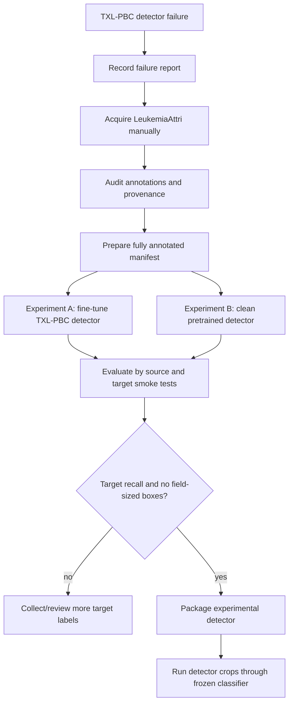

# M3.1 Detector Recovery

This project remains research-only and is not for clinical diagnosis.

## Why Threshold Tuning Failed

The TXL-PBC detector was swept on `wbc.jpg` from confidence `0.05` through `0.50`. It returned five detections at every threshold, while visual inspection showed seven WBCs. The missing cells were never proposed, so lowering confidence cannot recover them.

`wbc2.jpeg` produced one large field-sized box at every threshold instead of a tight WBC box. This is a localization failure, not a threshold failure.

The external failure record is `outputs/reports/txl_pbc_target_failure.json`.

## Why More Data Is Required

TXL-PBC already represents BCCD, BCDD, PBC, and Raabin-WBC sources, so those should not be redownloaded as independent new datasets. The failures occur on target microscope fields with different density, optics, field shape, and staining. Recovery needs fully annotated field images from additional acquisition domains.

LeukemiaAttri is useful because it is expected to provide complete microscope fields, WBC boxes, multiple microscopes/cameras/magnifications, and normal plus abnormal WBC morphology. Its download, license, hash, and exact annotation structure must be verified manually before training.

LISC is optional because it requires mask-to-box conversion and source-term review. It is not mandatory for the first LeukemiaAttri experiment.

## What Changed

- Added strict standard and extended YOLO annotation parsing.
- Added COCO annotation parsing.
- Added canonical detector mapping support for `candidate_wbc` and `artifact`.
- Added sparse-annotation rejection for training preparation.
- Added target hash leakage guard.
- Added circular/black-border field ROI detection.
- Added overlapping tile generation, coordinate mapping, and global NMS utilities.
- Added box sanity checks for field-sized boxes and other suspicious geometry.
- Added optional LISC mask-to-box utility.
- Added detector CLI support for `preprocess` and `audit`.
- Extended detector sweep reports with explicit preprocessing mode.

The frozen DinoBloom-B + MLP classifier remains unchanged.

## Implemented Commands

Verify the environment:

```bash
PYTHONPATH=src python3 -m bloodfilm.cli environment --output outputs/reports/environment.json
```

Audit a manually downloaded LeukemiaAttri-style extended YOLO directory:

```bash
PYTHONPATH=src python3 -m bloodfilm.cli detector audit \
  --format leukemia-attri-yolo \
  --image-root data/raw/LeukemiaAttri/images \
  --label-root data/raw/LeukemiaAttri/labels \
  --class-names "0=Neutrophil" \
  --class-mapping "Neutrophil=candidate_wbc" \
  --report-output outputs/reports/leukemia_attri_audit.json
```

Test ROI preprocessing on a target image:

```bash
PYTHONPATH=src python3 -m bloodfilm.cli detector preprocess \
  --input data/microscope_samples/wbc2.jpeg \
  --report-output outputs/reports/detector_preprocess_wbc2.json
```

Compare detector sweep modes in the report metadata:

```bash
PYTHONPATH=src python3 -m bloodfilm.cli detector sweep \
  --weights models/txl-pbc-yolo26n-v0.1/weights.pt \
  --input data/microscope_samples/wbc.jpg \
  --thresholds "0.05,0.10,0.15,0.25,0.35,0.50" \
  --mode full_field \
  --report-output outputs/reports/detector_sweep_microscope_wbc.json
```

Run all available checks:

```bash
PYTHONPATH=src python3 -m pytest -q
/tmp/opencode/typecheck-venv/bin/python -m ruff check src tests scripts
/tmp/opencode/typecheck-venv/bin/python -m mypy src
```

## Not Yet Implemented

These commands are part of the M3.1 plan but are intentionally not documented as runnable until implemented:

- unified multidomain manifest preparation CLI
- annotation overlay gallery rendering CLI
- target smoke-test evaluator with reviewed labels
- Kaggle training launch scripts for Experiments A and B
- trained multidomain model packaging

## Validation Status

The two target images are locked smoke tests, not a statistically meaningful validation set. M3 must remain blocked until at least 100-200 manually reviewed target-domain microscope fields exist.

Acceptance remains blocked until a real trained detector:

- detects all seven WBCs in `wbc.jpg`
- tightly detects the one WBC in `wbc2.jpeg`
- produces zero field-sized false boxes on the target smoke tests
- passes broader target-domain recall and false-box limits
- is packaged with truthful metrics and provenance

## Flow


